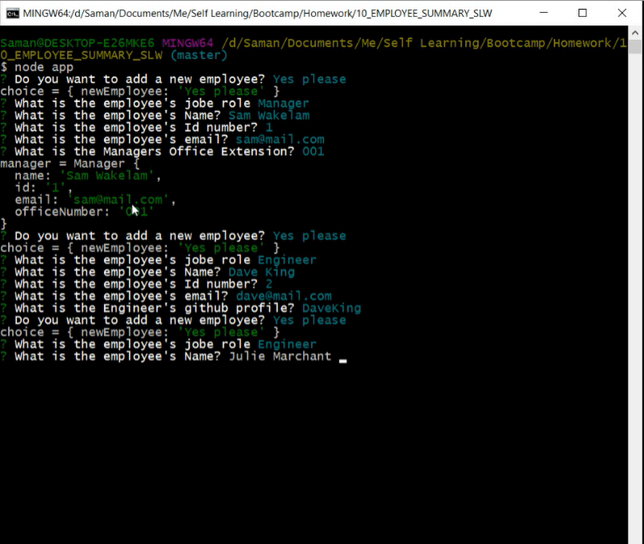
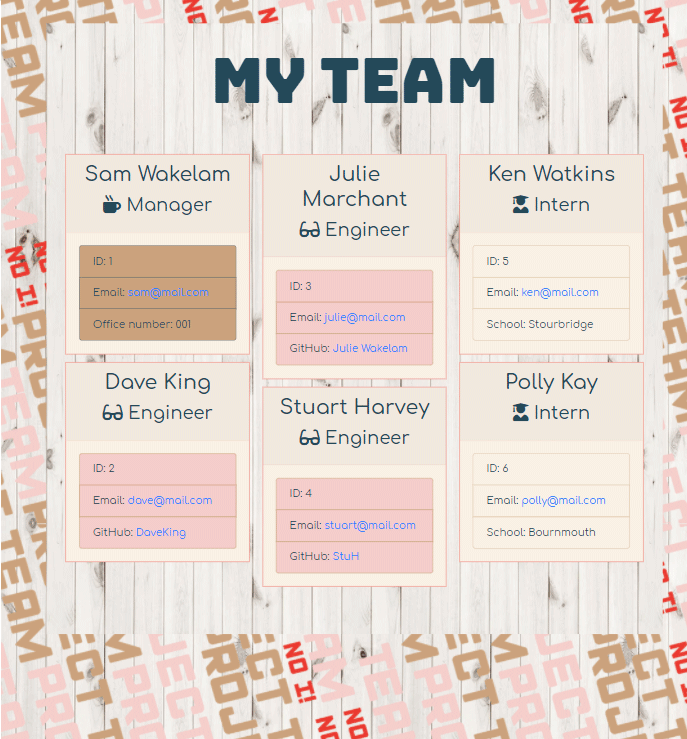

# My Team Profile Page. 

 
 
 

## Description

This project is about a Node command-line interface that takes information about employees and generates an HTML webpage that displays summaries for each person. 

The application will prompt the user for information about the team manager and then information about the team members. The user can input any number of team members, and they may be a mix of engineers and interns. When the user has completed building the team, the application will create an HTML file that displays a nicely formatted team roster based on the information provided by the user.

This allows a manager of a team to generate a web page that displays their team’s basic information and gives them quick access to emails and Github profiles. 

I have learnt for this project the use of classes to create an overall template for all employees and then to have extended attributes for different types of employee. I have been able to utilise the inquire package again for this project and cement my understanding and develop the exact questioning and out put that I wish to receive. I have been able to see how the rest of the process to write to html and organise code works and from this I wish to investigate templating methods as it looks really useful for future work. 

My project stands out by the circulating use of the inquirer package, it uses all the same questions for each type of employee but uses the When statement to display the specific questions when a type of employee is selected. I have investigated the use of email-validator to verify the input for the email section, and inquirers inbuilt validate function to validate the id NUMBER. Once an employee has been completed, the prompt is sent back to ask if you want to add another employee, exit or clear the current list.

## Contents: 
1. [Installation](#Instalation) 
2. [Usage](#Usage)
3. [Improvements](#Improvements)
4. [Updates](#Updates)
5. [Credits](#Credits)
6. [License](#License)
7. [Contact](#Contact)

## Instalation

* Step 1: Download the project to your local machine. .  
* Step 2: You will need to install the following packages: npm Inquirer and npm email-validator. .  
* Step 3: Use the command line > npm install inquirer.  
* Step 4: Use the command line > npm email-validator.  

### Technologies 

The technologies I have used are:
* HTML 
* CSS 
* Javascript 
* Node.js 
* npm Inquirer 
* npm Email-Validator 

## Usage

* Step 1: The application once downloaded will be invoked by using the following command in your command-line or terminal: > node app.  

* Step 2: You will be asked if you want to add an employee, Exit the interface or clear the employee list. At this time there is no persistent memory so the application will be clear each time you initialise the command-line. .  
* Step 3: If you clear existing you are asked to confirm this action again before the list is cleared. You will be returned to the initial question in step 2. .  
* Step 4: When choosing the new employee option you will be asked to choose the type of employee, the application will then run the general questions for each employee followed by a type specific question. When you have finished entering your employee details, your information is added to an array of objects and you are returned to the initial question in step 2. .  
* Step 5: Keep adding employees until you have finished. And choose Exit as the option from the initial question in step 2. This will exit the command line and write your employees to the HTML templates and main application.  

View this page also on [Github pages](https://samwakelam.github.io/10_EMPLOYEE_SUMMARY_SLW/).

## Improvements

There is nothing to display at this time.

## Updates 

There is nothing to display at this time.

    
## Credits 

Thanks go to:
* Colum Lynagh - For helping me to run the test scenarios given. 
   

Resources I have referenced:   
* W3shools  
* https://developer.mozilla.org/en-US/docs/Web/JavaScript/Reference/Classes 
* https://www.npmjs.com/package/email-validator 

## License 

* GNU GPL v3   

Where appropriate: 
Alot of the graphics included in my projects I have drawn myself and are copyright 2020. 
No useage without permission. 
If I have not originated the imagery I have gained the permission of the owner and acreditied 
where necessary. These are also not for re-purpose without permission of the owner.

You must make reference where the code originated. I would also love to see what changes and improvements you make.  
Design by Samantha Wakelam, please respect copyright 2020. 

## Contact

* Name: Sam Wakelam    Email: sam.wakelam@hotmail.co.uk  Github Profile: Sam Wakelam

